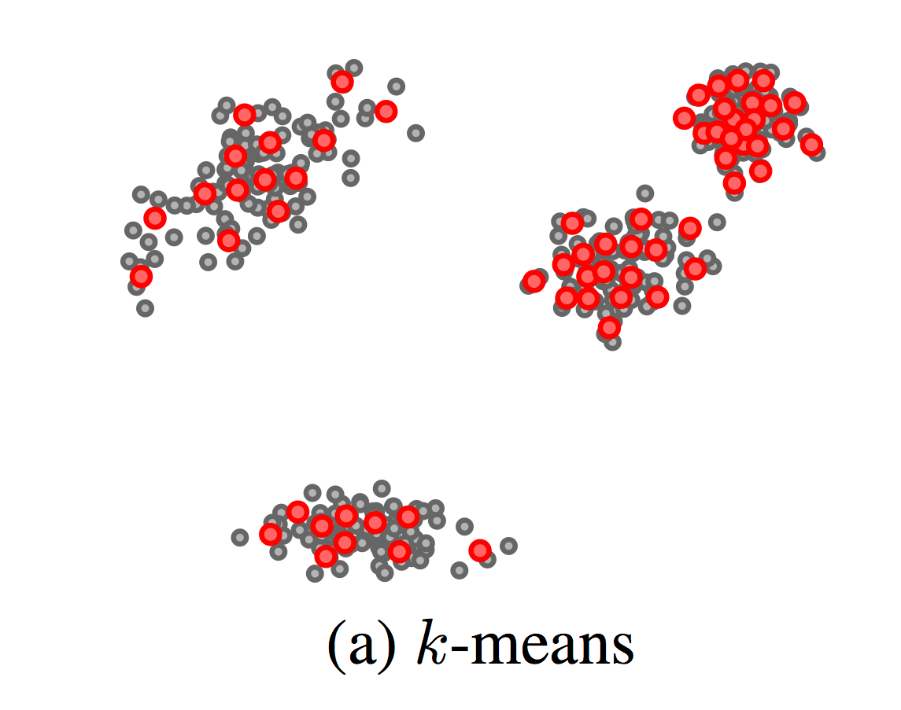
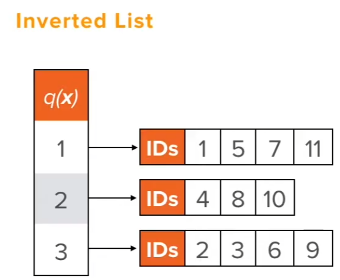
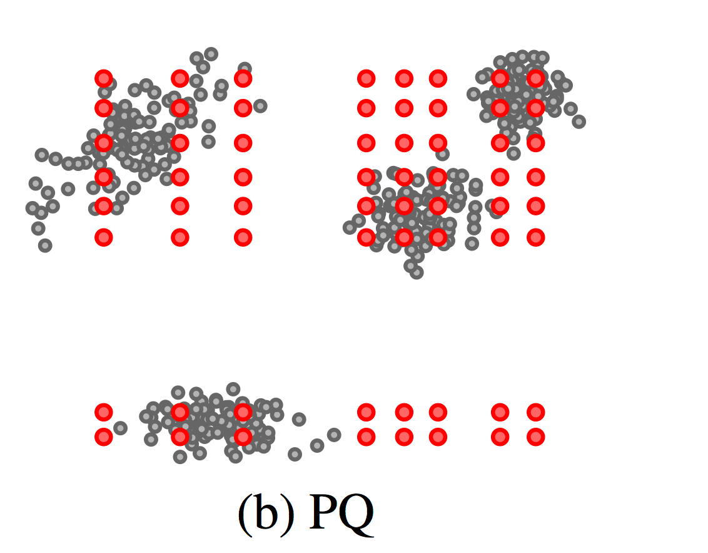
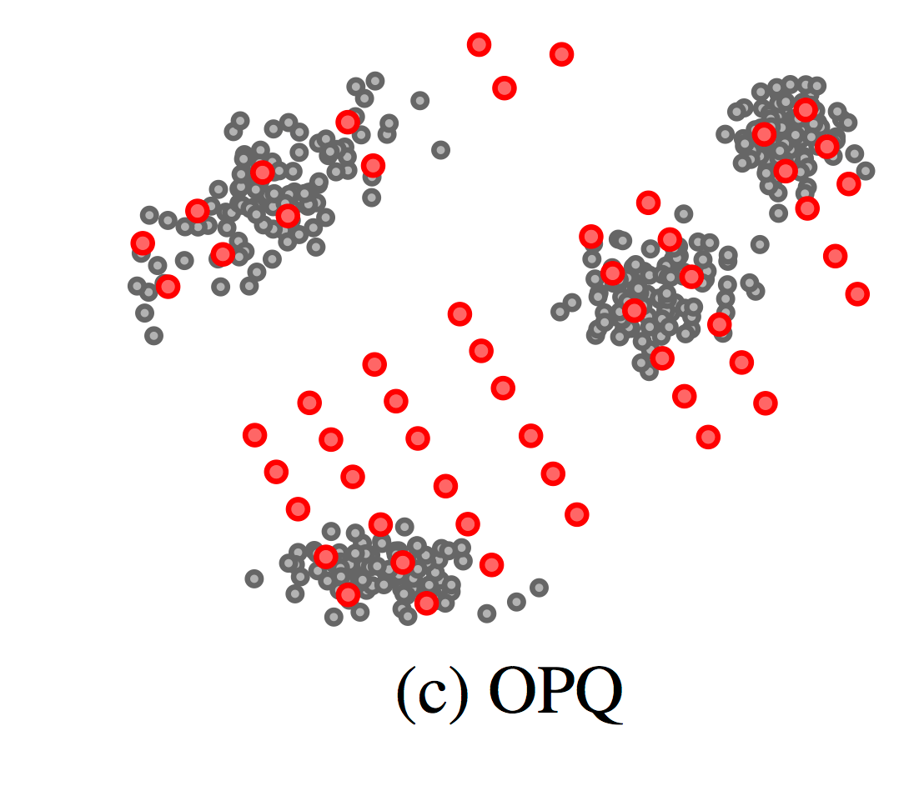
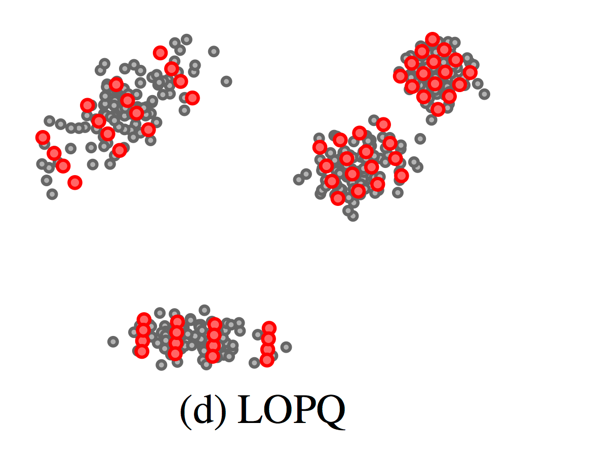
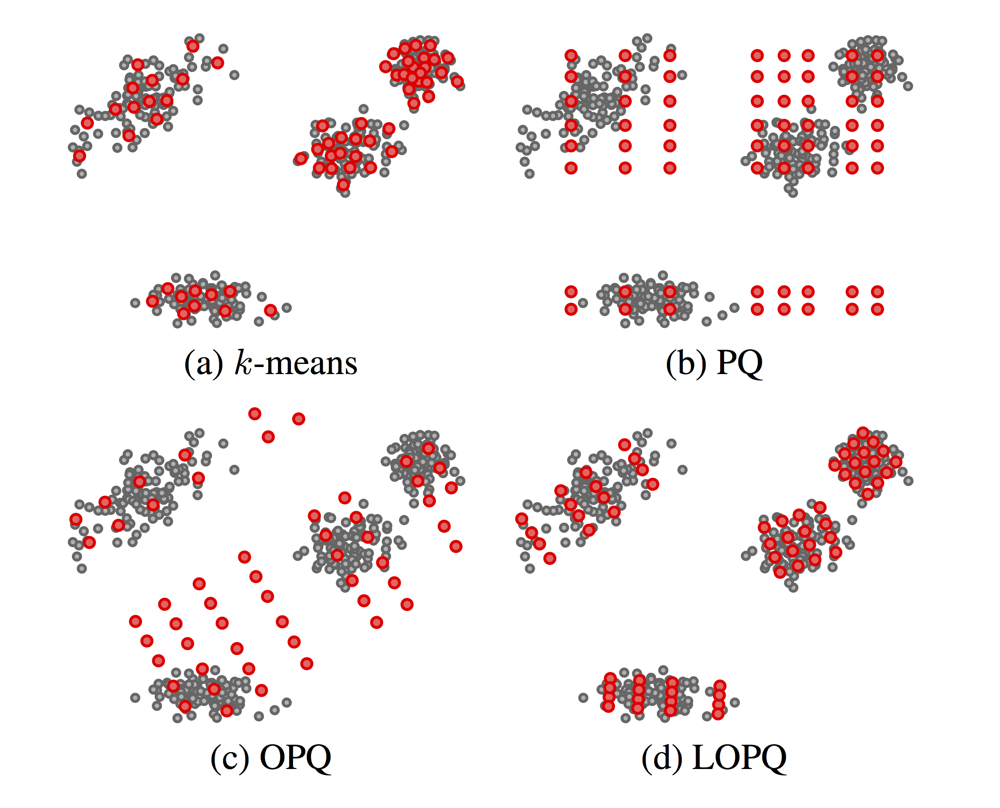

# Scalable Recognition Improved
A python implementation for a scalable object detection framework. 
This is an improved version of the [Scalable Recognition repository](https://www.github.com/DaanS8/ScalableRecognition) that was based on the paper [Scalable Recognition with a Vocabulary Tree](https://ieeexplore.ieee.org/document/1641018). 
Due to the use of state-of-the-art datastructures for nearest neighbor search the efficiency and accuracy was improved dramatically.
F.e. on my dataset of 100,000 images the original repository achieved an accuracy of 85,5% with a process time of 1,33s/image.
This repository achieved an accuracy of 96.5% with a process time of 1.16s/image.

## Instalation

Conda Installation:

    conda install -c conda-forge opencv numpy-indexed faiss-gpu cudatoolkit=xx.x

How you can check your cuda version is explained [here](https://stackoverflow.com/questions/9727688/how-to-get-the-cuda-version).

## How to use

### Setup

Put all your database images in the `data/` folder. 
Every image should have the format id.jpg where id is an integer. 
To be complete, the ids aren't required to be sequential. 
The images in the data/ folder are often referred to as the db (database) images.

Put all your query images in the `testset/` folder. 
Using subfolders like `testset/Easy/` etc. is possible.
Every image must have a .jpg extension.
Optional: if you'd like to test the accuracy, then name every query image id.jpg where id is the id of the correct db image match.

Checkout which database structure you need. 
In the [wiki](https://github.com/facebookresearch/faiss/wiki/Indexing-1G-vectors) of the faiss library benchmarks of different database structures using different vectors are given, under the menu item _Typical use cases and benchmarks_.
My database contained 200M SIFT vectors, so I've used `OPQ32_64,IVF262144(IVF512,PQ32x4fs,RFlat),PQ32x4fsr` as my data structure because it's (one of) the best index structures for 100M SIFT vectors.

The number `_,IVFxxxxxx_,_` defines how large your training set needs to be. 
The number of descriptors used in the training set lie between `30*xxxxxx` and `256*xxxxxx`.
In this project you just set the parameter `FRACTION_DES_USED_FOR_TRAINING` equal to `#training_des/#total_des`.

Make sure you have enough memory available for the program. 
Provide at least the size of `FRACTION_DES_USED_FOR_TRAINING * size_of_all_des * 2`.
In a Windows machine, you can increase the memory size by following the steps on:
https://www.windowscentral.com/how-change-virtual-memory-size-windows-10.

### Offline

Run `offline.py`. 
This wil generate an index and a list of keypoints of every descriptor of every image in the `data/` folder.
Specify the filename of the keypoint list and the index in `parameters.py`.

### Online

Run `online_debug.py` to get accuracy and performance results on all your images in the `testset/` folder or subfolders.

Run `online.py` to test single images using the command line.

## How it works

The faiss library developed by Facebook AI Research uses state-of-the-art data structures.
Here we'll briefly (try to) explain the concepts behind LOPQ, one of the most accurate datastructures at this time.
To better understand it, I highly recommend the following video: https://www.youtube.com/watch?v=RgxCaiQ-kig.

### Q

Quantisation is essentially just running k-means. 
Please read [_Scalable Recognition > How It Works > Scaling Up > K-means_](https://github.com/DaanS8/ScalableRecognition#k-means) to understand the algorithm.
K-means is a clustering algorithm, it assigns every vector to one of the k clusters. 

To search the closest vector using quantisation, the only distance calculation needed is between the cluster centers.
An inverted file index keeps track of which vectors are assigned to which cluster center.

The image below shows an example of an inverted list.
Every cluster center has a list of ids of which vector is assigned to it.
If we use the ids in the inverted file list as correct matches we lose information.
The true distance is lost, it's possible to re-rank the vectors by storing them, but this requires linear storage.
Note that this is the approach used in [Scalable Recognition](https://www.github.com/DaanS8/ScalableRecognition), but then with a tree.
There we use the ids in the inverted file list to assign a score to every image and finally using stored vectors test the best results.
This requires linear storage which can be expensive for extremely large datasets!

### PQ

Product Quantisation 

### OPQ

Optimised Product Quantisation

### LOPQ

Locally Optimised Product Quantisation

